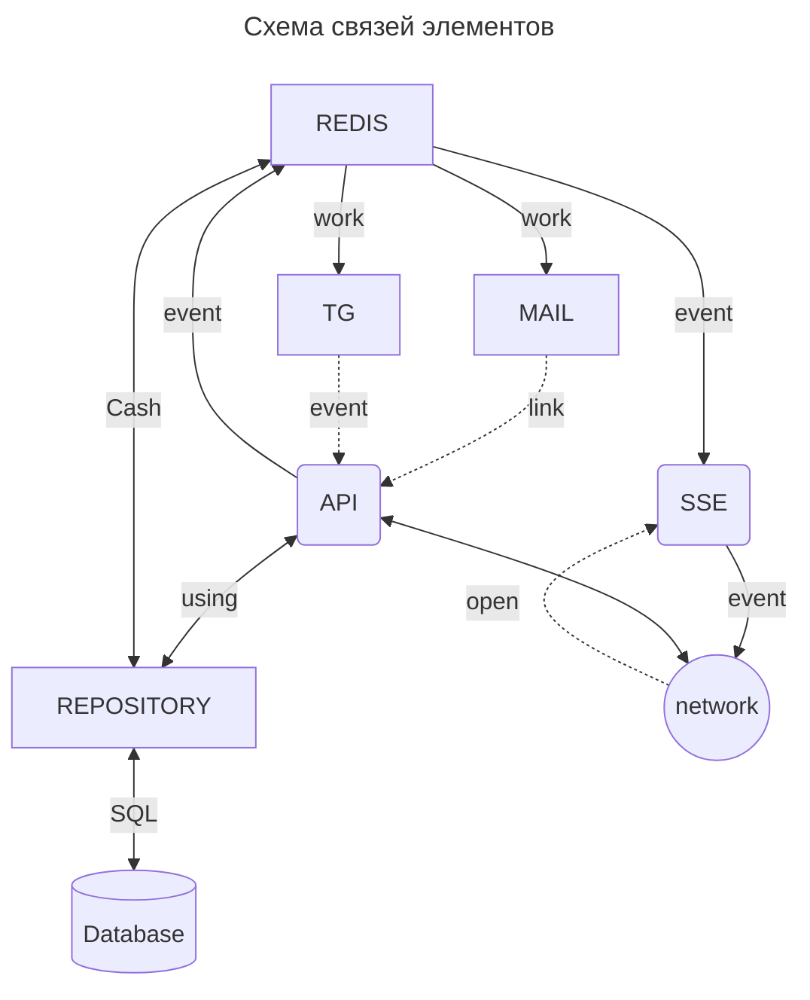

Состоит из:
- [[API]]
- [[DB]]
- [[SSE]]
- [[Redis]]
- [[Mail]]
- [[TG]]

```mermaid
---
title: Схема связей элементов
---
flowchart TD
    A[REDIS] --> |event| B(SSE)
    C(API) --> |event| A
    A --> |work| D[MAIL]
    A --> |work| E[TG]
    C <--> |using| F[REPOSITORY]
    F <--> |SQL| G@{ shape: cyl, label: "Database" }
    A <--> |Cash| F
    D -.-> |link| C
    E -.-> |event| C
    B --> |event| I@{ shape: circle, label: "network" }
    C <--> I
    I -. open .-> B

```
