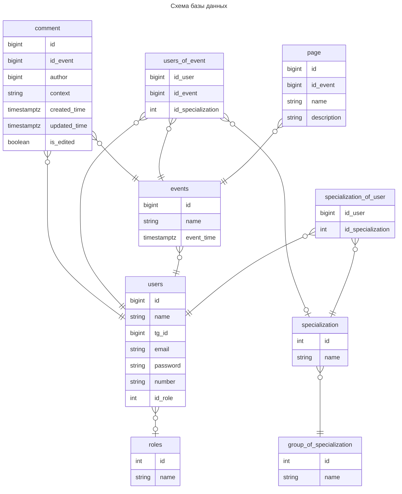
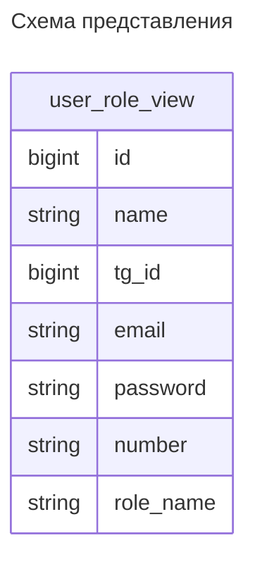

Надо:
- хранения фотографий пользователей
- история отписок от рассылок по почте

```mermaid
---
title: Схема базы данных
---
erDiagram
    users {
        bigint id
        string name
        bigint tg_id
        string email
        string password
        string number
        int id_role
    }
    roles {
        int id
        string name
    }
    group_of_specialization {
        int id
        string name
    }
    specialization {
        int id
        string name
    }
    specialization_of_user {
        bigint id_user
        int id_specialization
    }
    events {
        bigint id
        string name
        timestamptz event_time
    }
    page {
        bigint id
        bigint id_event
        string name
        string description
    }
    users_of_event {
        bigint id_user
        bigint id_event
        int id_specialization
    }
    comment {
        bigint id
        bigint id_event
        bigint author
        string context
        timestamptz created_time
        timestamptz updated_time
        boolean is_edited
    }
    users }o--o| roles : ""
    specialization }o--|| group_of_specialization : ""
    specialization_of_user }o--|| users : ""
    specialization_of_user }o--|| specialization : ""
    events }o--|| users : ""
    page }o--|| events : ""
    users_of_event }o--|| users : ""
    users_of_event }o--|| events : ""
    users_of_event }o--o| specialization : ""
    comment }o--|| events : ""
    comment }o--|| users : ""
```

Для удобства создано представление совмещающее таблицы *users* и *roles*.

```mermaid
---
title: Схема представления
---
erDiagram
    user_role_view {
        bigint id
        string name
        bigint tg_id
        string email
        string password
        string number
        string role_name
    }
```